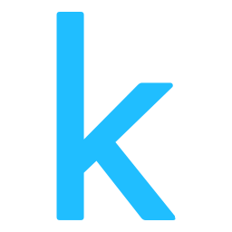

# Hi, I'm Mert and welcome to my GitHub profile!

- Engaged in AI & Data Science projects, exploring various tools and technologies.
- Actively learning Deep Learning, NLP, and related technologies.
- Ready to collaborate on diverse projects and eager to connect with fellow enthusiasts in the data science community.
- Aspiring to contribute as a Data Analyst/Data Scientist, driven by a passion for uncovering insights in data.

### How to reach me:
-  **LinkedIn:** https://www.linkedin.com/in/mert-arda
-  **Kaggle:** https://www.kaggle.com/mardas

## Languages and Databases:

-  Python
-  R
-  SQL
-  PostgreSQL
-  MySQL

## ML/DL

-  Jupyter Notebook
-  Scikit-Learn
-  Numpy
-  Pandas
-  Seaborn
-  Matplotlib
-  Keras
-  TensorFlow

## Data Visualization & Analytics

-  Power BI
-  Tableau

## Certifications

- DataCamp

## LeetCode

